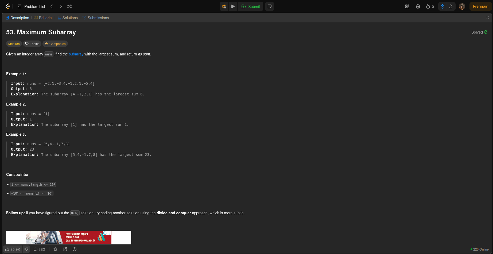
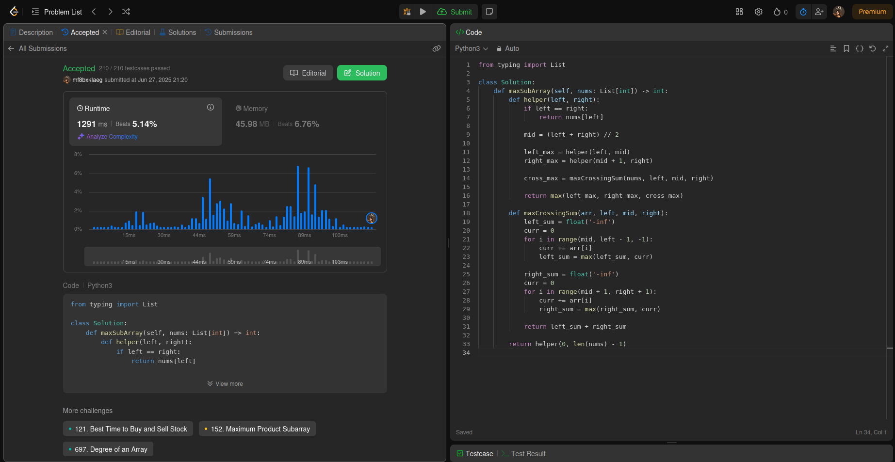
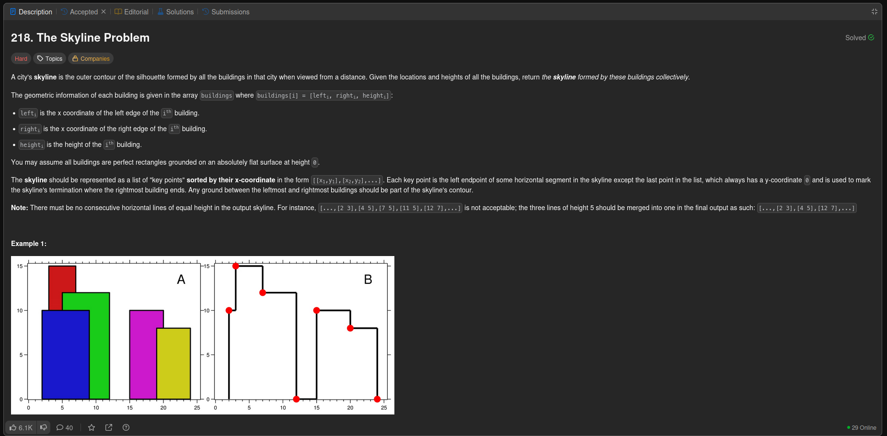
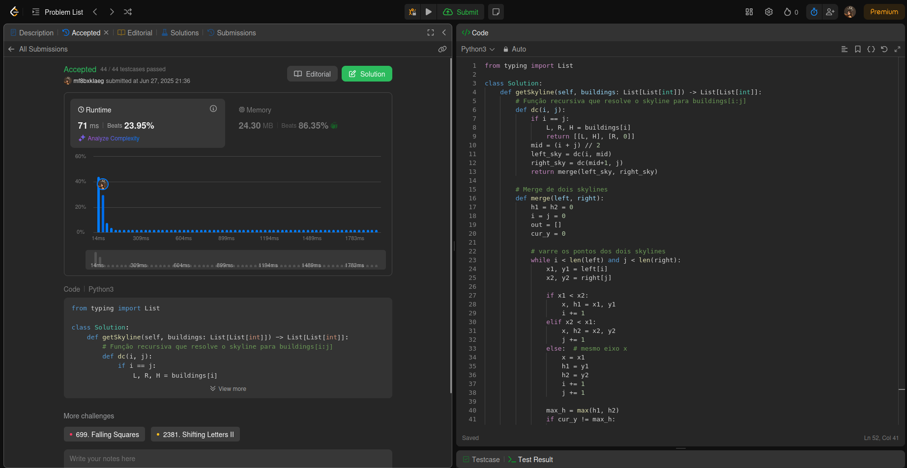
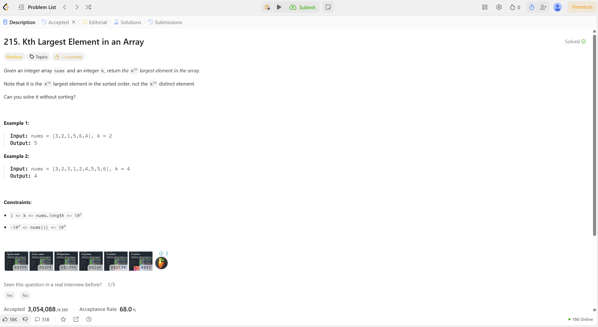
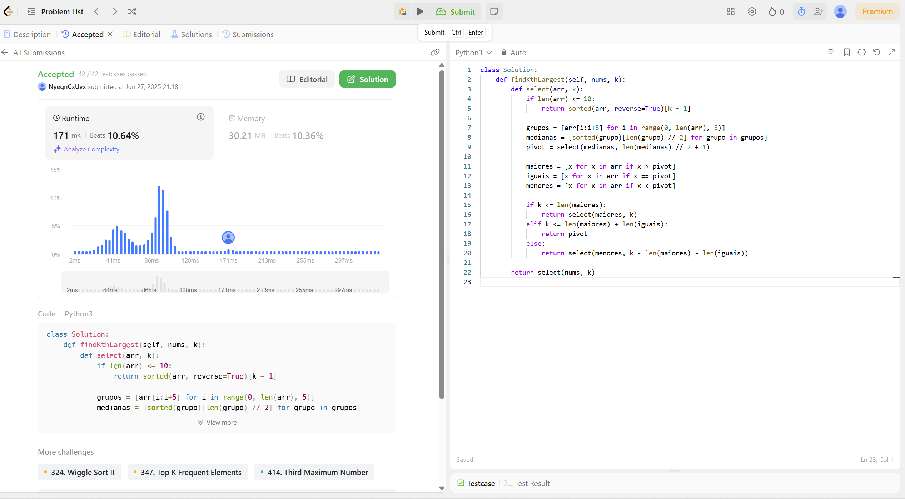
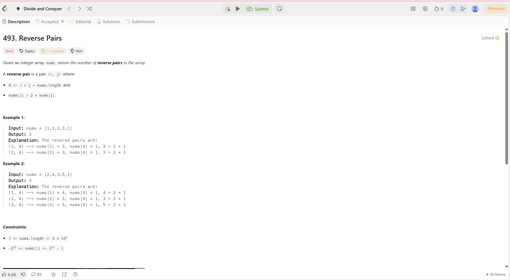
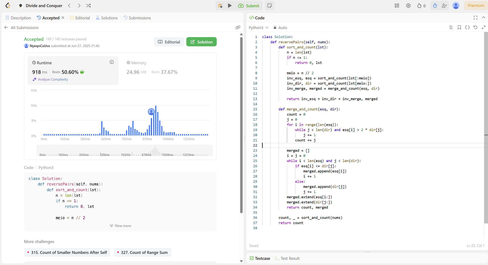

# Questões Dividir e Conquintar - Beecrowd

### **Número do trabalho:** 4
### **Conteúdo da Disciplina:** Dividir e Conquistar 

### **Alunos**

| Matrícula   | Aluno                                       |
|-------------|---------------------------------------------|
| 190033011   |  Luana Souza Silva Torres          |
| 211045196   | Suzane Alves Duarte        |

## **Vídeo de Apresentação**

No link abaixo é possível ver o vídeo de apresentação do projeto com mais detalhes:

[Link para apresentação]()

## **Sobre**

Este projeto tem como foco a resolução de problemas do site **LeetCode**, utilizando a linguagem **Python** como ferramenta principal para implementar soluções eficientes e organizadas.

O objetivo da iniciativa é aplicar de forma prática os conhecimentos adquiridos na disciplina de **Projeto de Algoritmos**, com ênfase em estratégias como algoritmos gananciosos, força bruta, dividir e conquistar, entre outros. Cada problema selecionado é acompanhado de uma análise de sua proposta, implementação da solução e verificação de desempenho.

O trabalho visa não apenas desenvolver habilidades técnicas na resolução de problemas computacionais, mas também estimular a análise crítica, a prática colaborativa e o uso de boas práticas de programação.

A seguir, a tabela com as questões a serem resolvidas e suas respectivas informações:

| Questão | Responsável pela resolução | Link da questão | Tema do problema | Nível de dificuldade |
|--------|---------------------------|----------------|------------------------|----------------------|
|Questão 1| Suzane Duarte | https://leetcode.com/problems/maximum-subarray/description/ | Maximum Subarray | Médio |
|Questão 2| Suzane Duarte | https://leetcode.com/problems/the-skyline-problem/ | The Skyline Problem | Difícil |
|Questão 3| Luana Torres | https://leetcode.com/problems/kth-largest-element-in-an-array/ | Kth Largest Element in an Array | Médio |
|Questão 4| Luana Torres | https://leetcode.com/problems/reverse-pairs/ | Reverse Pairs| Díficil |

## **Objetivos do Projeto**

- Aplicar conceitos de Algoritmos por meio da resolução prática de problemas.
- Desenvolver soluções em Python para diferentes tipos de desafios propostos pelo Beecrowd.
- Estimular o raciocínio lógico, a análise de complexidade e a escolha de estratégias adequadas. 
- Promover a prática colaborativa entre os participantes do projeto.
- Documentar e organizar as soluções com clareza, facilitando o entendimento e a reutilização do código.

## **Screenshots**

A seguir, são apresentados screenshots das questões resolvidas: 

Descrição da Questão 1:

 

Resolução da Questão 1: 

 

Questão 2:

 

Resolução da Questão 2: 

 

Descrição da Questão 3:

 

Resolução da Questão 3: 

 

Descrição da Questão 4:

 

Resolução da Questão 4: 

 

## **Instalação**

- **Linguagem:** Python  

### **Pré-requisitos:**  

É necessário apenas possuir um login no site Beecrowd para subemeter o código das questões. 

## **Uso**

1. Acesse o site e faça login: https://app.learnleetcode.com/login

2. Ao acessar determinado problema, escolha a linguagem a qual deseja submeter o código para a resolução do problema.

3. Insira o código para resolução do problema no campo "</>Code". 

4. Selecione o botão "Submit" 

5. Confira se a resolução proposta para o exercício foi submetida corretamente.
